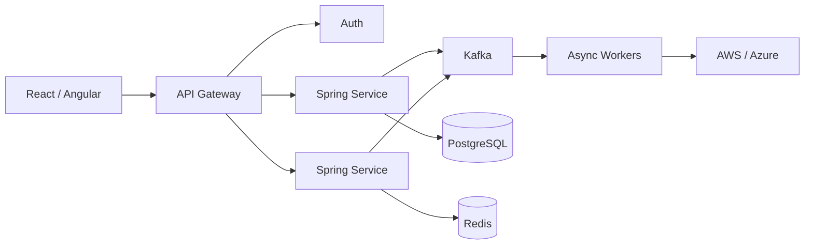
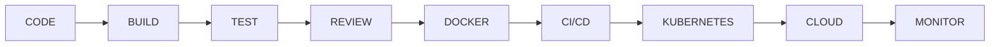

<!-- ============================================================
     AKSHAY KONAGALLA — GITHUB PROFILE
     Full Stack Developer | Java | Spring Boot | React | Cloud
============================================================= -->

<div align="center">


[](https://git.io/typing-svg)

<br/>


&nbsp;

&nbsp;

&nbsp;


<br/><br/>

### `FULL STACK` • `CLOUD` • `DISTRIBUTED SYSTEMS` • `AI`

</div>

---

## 👨‍💻 About Me

<table>
<tr>
<td width="58%" valign="top">

### Building software from interface to infrastructure.

I'm **Akshay Konagalla**, a Full Stack Developer focused on building secure, scalable, and maintainable applications across the complete engineering lifecycle.

My work spans **frontend experiences, backend APIs, microservices, databases, event-driven systems, cloud infrastructure, automated testing, and production delivery**.

I enjoy solving engineering problems where performance, reliability, security, and maintainability all matter.

<br/>

**Current engineering focus**

⚙️ Java & Spring Boot backend systems  
⚡ React & TypeScript applications  
📡 Microservices & event-driven architecture  
☁️ Cloud-native application delivery  
🗄️ High-performance data systems  
🔐 Secure application architecture  
🤖 AI-assisted software engineering  

</td>

<td width="42%" valign="top">

### ⚡ Quick Profile

```yaml
Role: Full Stack Developer
Experience: 4+ Years

Backend:
  Java 17
  Spring Boot
  Microservices

Frontend:
  React
  TypeScript

Data:
  PostgreSQL
  Redis

Messaging:
  Kafka

Cloud:
  AWS
  Azure

DevOps:
  Docker
  Kubernetes
  Terraform
```

</td>
</tr>
</table>

---

<div align="center">

## 🧰 Technology Stack

### Languages


<br/><br/>

### Backend & Frameworks


<br/>

`Spring Boot` • `Spring Cloud` • `Spring MVC` • `Spring Security`  
`Spring WebFlux` • `Spring Batch` • `Hibernate` • `JPA` • `Microservices`

<br/>

### Frontend


<br/>

`React` • `TypeScript` • `Angular` • `Next.js` • `Redux`  
`RxJS` • `React Query` • `WebSockets` • `SCSS`

<br/>

### Databases & Caching


<br/>

`PostgreSQL` • `MySQL` • `MongoDB` • `Oracle`  
`Cassandra` • `Redis` • `Supabase` • `Firebase`

<br/>

### Cloud & DevOps


<br/>

`AWS EC2` • `Lambda` • `S3` • `API Gateway` • `ECS` • `EKS`  
`Azure AKS` • `Azure Functions` • `Helm` • `CI/CD`

<br/>

### Messaging & Distributed Systems


<br/>

`Apache Kafka` • `RabbitMQ` • `AWS SQS`  
`Event-Driven Architecture` • `Distributed Systems`

</div>

---

## 💼 Professional Experience

<table>
<tr>
<td width="22%" align="center" valign="top">

### 🏦
### Goldman Sachs

`2026 — PRESENT`

</td>

<td width="78%" valign="top">

### Sr. Full Stack Developer

**Java • Spring Boot • React • TypeScript • PostgreSQL • Redis • Kafka**

Building and supporting enterprise full-stack applications across backend services, frontend experiences, data persistence, caching, event processing, and application security.

- Develop backend services using **Java and Spring Boot**
- Build and integrate **REST APIs**
- Develop interfaces using **React and TypeScript**
- Work with **PostgreSQL, Hibernate, and Redis**
- Integrate **Apache Kafka** for asynchronous communication
- Apply **Spring Security** for secure service access

</td>
</tr>
</table>

<br/>

<table>
<tr>
<td width="22%" align="center" valign="top">

### 🛒
### Walmart

`2025`

</td>

<td width="78%" valign="top">

### Software Engineer

**AWS • Azure • Docker • Kubernetes • Terraform • CI/CD**

Worked across cloud infrastructure, deployment automation, testing, and production observability.

- Containerized applications with **Docker**
- Supported orchestration using **Kubernetes**
- Worked with **AWS and Azure**
- Automated infrastructure using **Terraform**
- Supported CI/CD with **Jenkins and GitHub Actions**
- Used **JUnit and Mockito** for automated testing
- Worked with **Splunk, Grafana, Prometheus, and CloudWatch**

</td>
</tr>
</table>

<br/>

<table>
<tr>
<td width="22%" align="center" valign="top">

### 💻
### Deloitte

`2022 — 2024`

</td>

<td width="78%" valign="top">

### Associate Java Developer

**Java • Spring MVC • Hibernate • Oracle • SQL • JPA**

Built my enterprise software engineering foundation across Java development, database integration, automated testing, defect resolution, and Agile delivery.

- Developed Java application components using **Spring MVC**
- Worked with **JDBC, JSP, Hibernate, and JPA**
- Developed database functionality using **Oracle, SQL, and PL/SQL**
- Used **Maven, JUnit, and Mockito**
- Participated in peer reviews and Agile development
- Worked with **Git, Bitbucket, JIRA, and Confluence**

</td>
</tr>
</table>

---

<div align="center">

## 🧠 Engineering Focus

</div>

<table>
<tr>

<td width="33%" valign="top">

### ⚙️ Backend Engineering

Building modular backend services with clean separation of responsibilities.

**Core**

`Java 17`

`Spring Boot`

`REST APIs`

`Microservices`

`Hibernate / JPA`

</td>

<td width="33%" valign="top">

### 📡 Distributed Systems

Designing asynchronous and event-driven workflows.

**Core**

`Apache Kafka`

`RabbitMQ`

`AWS SQS`

`Redis`

`Event-Driven Architecture`

</td>

<td width="33%" valign="top">

### ☁️ Cloud Engineering

Taking applications beyond local development into reliable environments.

**Core**

`AWS`

`Azure`

`Docker`

`Kubernetes`

`Terraform`

</td>

</tr>
</table>

<table>
<tr>

<td width="33%" valign="top">

### 🎨 Frontend

Creating responsive and maintainable user experiences.

**Core**

`React`

`TypeScript`

`Angular`

`Next.js`

`Redux`

</td>

<td width="33%" valign="top">

### 🔐 Security

Integrating authentication and authorization into application architecture.

**Core**

`OAuth2`

`JWT`

`Spring Security`

`AWS Cognito`

`Okta / SSO`

</td>

<td width="33%" valign="top">

### 🧪 Quality

Building confidence through automated testing and validation.

**Core**

`JUnit`

`Mockito`

`Jest`

`Cypress`

`Playwright`

</td>

</tr>
</table>

---

## 🏗️ How I Think About Systems



<div align="center">

### A successful system needs more than working code.

`SCALABLE` • `SECURE` • `TESTABLE` • `OBSERVABLE` • `MAINTAINABLE`

</div>

---

## 🔄 Development & Delivery

<div align="center">

### `01`

### Understand

↓  

### `02`

### Design

↓

### `03`

### Build

↓

### `04`

### Test

↓

### `05`

### Secure

↓

### `06`

### Deploy

↓

### `07`

### Observe

↓

### `08`

### Improve

</div>

<br/>



---

## 📡 Event-Driven Engineering

<table>
<tr>

<td width="50%" valign="top">

### Why Event-Driven?

I use asynchronous patterns when services should remain loosely coupled and independently scalable.

**Technologies**

⚡ Apache Kafka  
🐇 RabbitMQ  
☁️ AWS SQS  
🔄 Event-driven workflows  
📦 Distributed services  

</td>

<td width="50%" valign="top">

### Typical Flow

```text
Producer
   │
   ▼
 Event
   │
   ▼
 Kafka
   │
   ├── Service A
   ├── Service B
   └── Service C
          │
          ▼
       Storage
```

</td>

</tr>
</table>

---

## 🔐 Security Engineering

<div align="center">

`CLIENT`

↓

`IDENTITY`

↓

**OAuth2 • Okta • Cognito**

↓

`JWT`

↓

**Spring Security**

↓

`AUTHORIZATION`

↓

`PROTECTED RESOURCE`

</div>

<br/>

<div align="center">


</div>

---

## 🧪 Testing Strategy

<div align="center">

### Unit → Integration → API → UI → E2E → Production Confidence

<br/>


<br/><br/>


</div>

<br/>

**Backend:** JUnit 5 • Mockito  
**Frontend:** Jest • React Testing Library • Jasmine • Karma  
**E2E:** Cypress • Playwright  
**Practice:** Test-Driven Development

---

## 📊 Production & Observability

<table>
<tr>
<td width="50%" valign="top">

### 🔎 Observe

`Splunk`

`Prometheus`

`Grafana`

`CloudWatch`

</td>

<td width="50%" valign="top">

### 🛠️ Respond

`Log Analysis`

`Incident Investigation`

`Root-Cause Analysis`

`Production Troubleshooting`

`Service Stability`

</td>
</tr>
</table>

---

## 🤖 AI × Software Engineering

<table>
<tr>

<td width="55%" valign="top">

### AI-Assisted Development

I use modern AI tooling to accelerate research, implementation, debugging, and engineering workflows while keeping architecture, validation, security, and final technical decisions under engineering control.

**Tools & concepts**

`GPT Models` • `RAG Pipelines`  
`Cursor` • `Claude` • `GitHub Copilot`

</td>

<td width="45%" valign="top">

### My Principle

> **AI accelerates engineering.  
> Validation protects quality.**

AI is most useful when combined with strong engineering fundamentals, testing, and human judgment.

</td>

</tr>
</table>

---

## 🧭 Engineering Principles

<div align="center">

| PRINCIPLE | WHAT IT MEANS TO ME |
|:---:|:---|
| **SOLID** | Maintainable and extensible software |
| **DDD** | Model software around the actual domain |
| **TDD** | Build confidence while developing |
| **CI/CD** | Make delivery repeatable |
| **Security** | Design it in from the beginning |
| **Observability** | Know what the system is doing |
| **Ownership** | Follow the feature through production |

</div>

---

## 🎓 Education

<table>
<tr>

<td width="50%" valign="top">

### 🎓 Florida Atlantic University

**Master's in Computer Science**

Boca Raton, Florida

Graduate study in computer science with focus across software engineering, cloud computing, distributed applications, and data systems.

</td>

<td width="50%" valign="top">

### 🎓 Sathyabama University

**Bachelor's in Computer Science**

Chennai, India

Foundation in computer science, programming, software engineering, databases, and application development.

</td>

</tr>
</table>

---

## 📈 GitHub

<div align="center">


<br/>


</div>

---

## 📊 Contribution Activity

<div align="center">


</div>

---

## 🤝 What I Bring

<table>

<tr>

<td width="25%" align="center">

### ⚙️

### Full-Stack

Frontend through infrastructure.

</td>

<td width="25%" align="center">

### 🧠

### Architecture

Think beyond individual features.

</td>

<td width="25%" align="center">

### ☁️

### Cloud

Build with deployment in mind.

</td>

<td width="25%" align="center">

### 🔐

### Security

Protect systems by design.

</td>

</tr>

<tr>

<td width="25%" align="center">

### 🧪

### Quality

Test before production.

</td>

<td width="25%" align="center">

### 📊

### Observability

Understand production behavior.

</td>

<td width="25%" align="center">

### 🤝

### Collaboration

Communicate and review.

</td>

<td width="25%" align="center">

### 🚀

### Ownership

Build. Ship. Improve.

</td>

</tr>

</table>

---

<div align="center">

## 🌐 Let's Connect

### Building reliable software. Solving meaningful problems.

<br/>

[](https://linkedin.com/in/akshaykonagalla)
&nbsp;
[](https://github.com/akshaykonagalla)
&nbsp;
[](mailto:mrkonagalla@gmail.com)

<br/><br/>


<br/><br/>

### `DESIGN → BUILD → TEST → SHIP → OBSERVE → IMPROVE`

<br/>

**JAVA • SPRING BOOT • REACT • MICROSERVICES • CLOUD • DISTRIBUTED SYSTEMS**

<br/>


</div>
