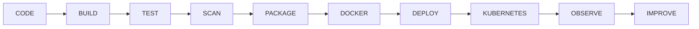

<!-- ═══════════════════════════════════════════════════════════════
     AKSHAY KONAGALLA • GITHUB ENGINEERING PROFILE
     FULL STACK • DISTRIBUTED SYSTEMS • CLOUD • AI
════════════════════════════════════════════════════════════════ -->

<div align="center">


<br/>

[](https://git.io/typing-svg)

<br/>


&nbsp;

&nbsp;

&nbsp;


<br/><br/>

### `ENGINEER` • `ARCHITECT` • `BUILDER`

</div>

---

# `00 // SYSTEM.IDENTITY`

```typescript
interface Engineer {
    name: string;
    role: string;
    experience: string;

    core: string[];
    architecture: string[];
    cloud: string[];
    data: string[];
    messaging: string[];

    mission: string;
}

const akshay: Engineer = {

    name: "Akshay Konagalla",

    role: "Full Stack Developer",

    experience: "4+ years",

    core: [
        "Java 17",
        "Spring Boot",
        "React",
        "TypeScript",
        "Microservices"
    ],

    architecture: [
        "Distributed Systems",
        "Event-Driven Architecture",
        "Domain-Driven Design",
        "SOLID",
        "REST APIs"
    ],

    cloud: [
        "AWS",
        "Azure",
        "Docker",
        "Kubernetes",
        "Terraform"
    ],

    data: [
        "PostgreSQL",
        "Redis",
        "MongoDB",
        "Oracle",
        "Cassandra"
    ],

    messaging: [
        "Apache Kafka",
        "RabbitMQ",
        "AWS SQS"
    ],

    mission:
        "Build secure, scalable and maintainable systems that ship."
};
```

<div align="center">

### From enterprise Java systems to cloud-native distributed applications.

**I work across the entire engineering lifecycle — architecture, development, testing, deployment and production reliability.**

</div>

<br/>

---

# `01 // TECH.STACK`

<div align="center">

### `LANGUAGES`


<br/>

### `BACKEND`


`Spring MVC` • `Spring Security` • `Spring WebFlux` • `Spring Batch`  
`JPA` • `Hibernate` • `Microservices` • `Akka Actors` • `Akka Streams` • `Akka Clustering`

<br/>

### `FRONTEND`


`React.js` • `Angular 10/16` • `Next.js` • `Redux` • `RxJS`  
`React Query` • `WebSockets` • `HTML5` • `CSS3` • `SCSS` • `Bootstrap`

<br/>

### `DATA`


`PostgreSQL` • `MySQL` • `MongoDB` • `Oracle`  
`Cassandra` • `Redis` • `Supabase` • `Firebase`

<br/>

### `EVENT STREAMING`


<br/>

### `CLOUD + DEVOPS`


</div>

### AWS

`EC2` • `Lambda` • `S3` • `API Gateway` • `ECS` • `EKS`

### Azure

`AKS` • `Azure Functions`

### Infrastructure & Delivery

`Docker` • `Kubernetes` • `Jenkins` • `GitHub Actions`  
`Helm` • `Terraform` • `Git` • `GitHub`

---

# `02 // SYSTEM.ARCHITECTURE`

```text
                              ┌─────────────────────┐
                              │      CLIENT         │
                              │ React / Angular / TS│
                              └──────────┬──────────┘
                                         │
                                   HTTPS / REST
                                         │
                              ┌──────────▼──────────┐
                              │     API GATEWAY     │
                              └──────────┬──────────┘
                                         │
                       ┌─────────────────┼─────────────────┐
                       │                 │                 │
                       ▼                 ▼                 ▼
                ┌────────────┐    ┌────────────┐    ┌────────────┐
                │ SERVICE A  │    │ SERVICE B  │    │   AUTH     │
                │Spring Boot │    │Spring Boot │    │OAuth2/JWT  │
                └─────┬──────┘    └──────┬─────┘    └────────────┘
                      │                  │
                      └────────┬─────────┘
                               │
                         ┌─────▼─────┐
                         │   KAFKA   │
                         │ EVENT BUS │
                         └─────┬─────┘
                               │
                 ┌─────────────┼─────────────┐
                 │             │             │
                 ▼             ▼             ▼
           ┌──────────┐  ┌──────────┐  ┌──────────┐
           │POSTGRESQL│  │  REDIS   │  │ WORKERS  │
           └──────────┘  └──────────┘  └─────┬────┘
                                              │
                                              ▼
                                      ┌──────────────┐
                                      │  AWS / AZURE │
                                      └──────────────┘
```

> ### Engineering principle
>
> A system isn't finished when the endpoint returns `200`.
>
> It should also be **secure, testable, observable, maintainable, resilient and deployable.**

---

# `03 // PROFESSIONAL.TIMELINE`

```text
╭──────────────────────────────────────────────────────────────╮
│                                                              │
│   2022                                                       │
│     │                                                        │
│     ├──── DELOITTE                                           │
│     │     Associate Java Developer                           │
│     │                                                        │
│     │     Java • Spring MVC • Hibernate                      │
│     │     Oracle • SQL • JPA • JUnit                         │
│     │                                                        │
│     ▼                                                        │
│   2025                                                       │
│     │                                                        │
│     ├──── WALMART                                            │
│     │     Software Engineer                                  │
│     │                                                        │
│     │     AWS • Azure • Kubernetes                           │
│     │     Terraform • CI/CD • Observability                  │
│     │                                                        │
│     ▼                                                        │
│   2026                                                       │
│     │                                                        │
│     └──── GOLDMAN SACHS                                      │
│           Sr. Full Stack Developer                           │
│                                                              │
│           Java • Spring Boot • React                         │
│           Kafka • PostgreSQL • Redis                         │
│                                                              │
│                         ● CURRENT                            │
│                                                              │
╰──────────────────────────────────────────────────────────────╯
```

---

# `04 // GOLDMAN.SACHS`

## 🏦 Sr. Full Stack Developer

**`JAN 2026 → PRESENT`** • New York, NY

```text
                           BANKING PLATFORM
                                  │
              ┌───────────────────┼───────────────────┐
              │                   │                   │
              ▼                   ▼                   ▼
          REACT + TS         SPRING BOOT          SECURITY
              │                   │                   │
              │              REST APIs           SPRING
              │                   │              SECURITY
              │                   │                   │
              └──────────────┬────┴───────────────────┘
                             │
                    ┌────────▼────────┐
                    │  MICROSERVICES  │
                    └────────┬────────┘
                             │
              ┌──────────────┼──────────────┐
              │              │              │
              ▼              ▼              ▼
            KAFKA        POSTGRESQL        REDIS
         EVENT FLOW      PERSISTENCE       CACHE
```

### Engineering Contributions

- Design secure banking service workflows using **Java, Spring Boot and REST APIs**
- Engineer responsive interfaces using **React + TypeScript**
- Work with **PostgreSQL, SQL, Hibernate and Redis**
- Integrate **Kafka** messaging across microservices
- Apply **Spring Security** controls across backend services
- Support authentication, access control and resilient service communication

### `STACK`

`JAVA` • `SPRING BOOT` • `REST` • `REACT` • `TYPESCRIPT`  
`POSTGRESQL` • `HIBERNATE` • `REDIS` • `KAFKA` • `SPRING SECURITY`

---

# `05 // WALMART`

## 🛒 Software Engineer

**`JAN 2025 → DEC 2025`** • Bentonville, AR

```text
                           SOURCE
                              │
                              ▼
                            GIT
                              │
                              ▼
                       MAVEN / GRADLE
                              │
                              ▼
                        BUILD + TEST
                              │
                              ▼
                 JENKINS / GITHUB ACTIONS
                              │
                              ▼
                           DOCKER
                              │
                              ▼
                         KUBERNETES
                              │
                  ┌───────────┴───────────┐
                  │                       │
                  ▼                       ▼
                 AWS                    AZURE
                  │                       │
                  └───────────┬───────────┘
                              │
                              ▼
                       OBSERVABILITY
                              │
              ┌───────────────┼───────────────┐
              ▼               ▼               ▼
           SPLUNK         PROMETHEUS        GRAFANA
                              │
                              ▼
                         CLOUDWATCH
```

### Engineering Contributions

- Configured cloud-ready deployments using **Docker, Kubernetes, AWS, Azure and Terraform**
- Automated CI/CD workflows using **Jenkins and GitHub Actions**
- Worked with **Maven and Gradle** build pipelines
- Validated REST endpoints and UI workflows
- Used **JUnit, Mockito, Postman and Selenium**
- Analyzed production logs and application metrics
- Worked with **Splunk, Grafana, Prometheus and CloudWatch**

### `STACK`

`AWS` • `AZURE` • `DOCKER` • `KUBERNETES` • `TERRAFORM`  
`JENKINS` • `GITHUB ACTIONS` • `JUNIT` • `PROMETHEUS` • `GRAFANA`

---

# `06 // DELOITTE`

## 💻 Associate Java Developer

**`JAN 2022 → JUN 2024`** • Hyderabad, India

```java
public final class EngineeringFoundation {

    private final String language =
        "Java";

    private final String backend =
        "Spring MVC + JDBC";

    private final String persistence =
        "Hibernate + JPA";

    private final String database =
        "Oracle + SQL + PL/SQL";

    private final String testing =
        "JUnit + Mockito";

    private final String delivery =
        "Maven + Git + Agile";

    public String philosophy() {
        return "Strong fundamentals create reliable systems.";
    }
}
```

### Engineering Contributions

- Developed enterprise Java components using **Spring MVC, JDBC, JSP and Hibernate**
- Built database-access routines using **Oracle, SQL, PL/SQL and JPA**
- Worked with **Git, Bitbucket, JIRA and Confluence**
- Participated in peer reviews and Agile sprint execution
- Resolved defects and refactored Java code
- Used **Maven, JUnit and Mockito** for build and quality workflows

### `STACK`

`JAVA` • `SPRING MVC` • `JDBC` • `JSP` • `HIBERNATE`  
`ORACLE` • `SQL` • `PL/SQL` • `JPA` • `MAVEN` • `JUNIT`

---

# `07 // EVENT.DRIVEN`

<div align="center">


</div>

```text
                          PRODUCER
                              │
                              ▼
                      ┌───────────────┐
                      │ EVENT STREAM  │
                      │     KAFKA     │
                      └───────┬───────┘
                              │
                ┌─────────────┼─────────────┐
                │             │             │
                ▼             ▼             ▼
             SERVICE       SERVICE       SERVICE
                A             B             C
                │             │             │
                ▼             ▼             ▼
           POSTGRES        REDIS       EXTERNAL API
```

### Technologies

`Apache Kafka` • `RabbitMQ` • `AWS SQS` • `Event-Driven Architecture`

---

# `08 // SECURITY.LAYER`

<div align="center">


</div>

```text
                         REQUEST
                            │
                            ▼
                        IDENTITY
                            │
             ┌──────────────┼──────────────┐
             ▼              ▼              ▼
           OAUTH2          OKTA          COGNITO
             │              │              │
             └──────────────┼──────────────┘
                            ▼
                           JWT
                            │
                            ▼
                     SPRING SECURITY
                            │
                            ▼
                      ACCESS CONTROL
                            │
                            ▼
                    PROTECTED RESOURCE
```

### Security Stack

`OAuth2` • `JWT` • `AWS Cognito` • `Firebase Auth`  
`Okta` • `SSO` • `Access Control` • `Vulnerability Remediation`

---

# `09 // QUALITY.ENGINEERING`

<div align="center">


</div>

```text
                 ┌────────────────────────┐
                 │   QUALITY PIPELINE     │
                 └────────────┬───────────┘
                              │
                              ▼
                          UNIT TEST
                              │
                              ▼
                      INTEGRATION TEST
                              │
                              ▼
                           API TEST
                              │
                              ▼
                            UI TEST
                              │
                              ▼
                            E2E
                              │
                              ▼
                   PRODUCTION CONFIDENCE
```

### Backend

`JUnit 5` • `Mockito`

### Frontend

`Jest` • `React Testing Library` • `Jasmine` • `Karma`

### End-to-End

`Cypress` • `Playwright`

### Practice

`Test-Driven Development`

---

# `10 // OBSERVABILITY`

```text
                        APPLICATION
                             │
          ┌──────────────────┼──────────────────┐
          │                  │                  │
          ▼                  ▼                  ▼
         LOGS              METRICS          CLOUD DATA
          │                  │                  │
          ▼                  ▼                  ▼
        SPLUNK           PROMETHEUS         CLOUDWATCH
                             │
                             ▼
                           GRAFANA
                             │
                             ▼
                         DASHBOARDS
                             │
                             ▼
                    INCIDENT RESPONSE
```

### Production Focus

`Logging` • `Metrics` • `Monitoring` • `Incident Analysis`  
`Root-Cause Analysis` • `Service Stability`

---

# `11 // AI.ENGINEERING`

<div align="center">


</div>

```python
ai_engineering = {

    "development": [
        "Cursor",
        "Claude",
        "GitHub Copilot"
    ],

    "models": [
        "GPT Models"
    ],

    "architecture": [
        "RAG Pipelines"
    ],

    "principle":
        "AI accelerates engineering. Validation protects quality."
}
```

---

# `12 // ENGINEERING.PRINCIPLES`

```text
                         ENGINEERING
                              │
       ┌──────────────────────┼──────────────────────┐
       │                      │                      │
       ▼                      ▼                      ▼
      SOLID                  DDD                SYSTEM DESIGN
       │                      │                      │
       ▼                      ▼                      ▼
 CLEAN DESIGN          DOMAIN MODELING        ARCHITECTURE
       │                      │                      │
       └──────────────────────┼──────────────────────┘
                              │
                              ▼
                      MAINTAINABLE SYSTEMS
```

### Practices

`SOLID Principles` • `Domain-Driven Design` • `System Design`  
`Agile / Scrum` • `CI/CD Automation` • `TDD`

---

# `13 // DELIVERY.PIPELINE`



<div align="center">

### `CODE` → `BUILD` → `TEST` → `SECURE` → `DEPLOY` → `OBSERVE` → `IMPROVE`

</div>

---

# `14 // ENGINEERING.MINDSET`

```text
01 // UNDERSTAND
        │
        ▼
02 // CLARIFY REQUIREMENTS
        │
        ▼
03 // IDENTIFY CONSTRAINTS
        │
        ▼
04 // DESIGN
        │
        ▼
05 // BUILD INCREMENTALLY
        │
        ▼
06 // TEST CONTINUOUSLY
        │
        ▼
07 // REVIEW SECURITY
        │
        ▼
08 // DEPLOY SAFELY
        │
        ▼
09 // OBSERVE PRODUCTION
        │
        ▼
10 // LEARN + IMPROVE
```

> **I don't measure engineering success by how much code was written.**
>
> I care about whether the system is understandable, reliable,
> secure, testable, observable and maintainable after it ships.

---

# `15 // SKILL.MATRIX`

| `DOMAIN` | `TECHNOLOGIES` |
|:---|:---|
| **Languages** | Java 17 · Python · TypeScript · JavaScript · Node.js · SQL · PL/SQL · C# |
| **Backend** | Spring Boot · Spring Cloud · Spring MVC · Spring Security · WebFlux · Spring Batch |
| **Persistence** | Hibernate · JPA |
| **Architecture** | Microservices · DDD · SOLID · Event-Driven Architecture · System Design |
| **Frontend** | React · Angular · Next.js · Redux · RxJS · React Query |
| **APIs** | REST · GraphQL · WebSockets |
| **Data** | PostgreSQL · MySQL · MongoDB · Oracle · Cassandra · Redis · Supabase · Firebase |
| **Messaging** | Kafka · RabbitMQ · AWS SQS |
| **Security** | OAuth2 · JWT · Cognito · Firebase Auth · Okta · SSO |
| **AWS** | EC2 · Lambda · S3 · API Gateway · ECS · EKS |
| **Azure** | AKS · Azure Functions |
| **Containers** | Docker · Kubernetes |
| **Infrastructure** | Terraform · Helm |
| **CI/CD** | Jenkins · GitHub Actions · Maven · Gradle |
| **Testing** | JUnit · Mockito · Cypress · Jest · Playwright · Jasmine · Karma |
| **AI** | GPT Models · RAG Pipelines · Cursor · Claude · GitHub Copilot |

---

# `16 // EDUCATION`

<table>
<tr>
<td width="50%" valign="top">

### 🎓 Florida Atlantic University

**Master's — Computer Science**

Advanced graduate study in computer science and software engineering.

</td>

<td width="50%" valign="top">

### 🎓 Sathyabama University

**Bachelor's — Computer Science**

Foundation in software engineering, programming, data systems and computer science.

</td>
</tr>
</table>

---

# `17 // GITHUB.SIGNAL`

<div align="center">


<br/><br/>


<br/><br/>


</div>

---

# `18 // WHAT.I.BRING`

<table>
<tr>

<td width="33%" valign="top">

### ⚙️ FULL STACK

Frontend through backend,
data and infrastructure.

`React`

`Spring Boot`

`PostgreSQL`

`AWS`

</td>

<td width="33%" valign="top">

### 🧠 ARCHITECTURE

Systems designed around
maintainability and scale.

`Microservices`

`Kafka`

`DDD`

`SOLID`

</td>

<td width="33%" valign="top">

### 🚀 DELIVERY

Engineering beyond
local development.

`CI/CD`

`Docker`

`Kubernetes`

`Observability`

</td>

</tr>

<tr>

<td width="33%" valign="top">

### 🔐 SECURITY

Security built into
application architecture.

`OAuth2`

`JWT`

`Spring Security`

`SSO`

</td>

<td width="33%" valign="top">

### 🧪 QUALITY

Confidence through
automated validation.

`JUnit`

`Mockito`

`Cypress`

`Playwright`

</td>

<td width="33%" valign="top">

### 🤝 COLLABORATION

Engineering is a
team discipline.

`Code Reviews`

`Agile`

`Documentation`

`Ownership`

</td>

</tr>
</table>

---

# `19 // CONNECT`

<div align="center">

### `LET'S BUILD SOFTWARE WORTH SCALING.`

<br/>

[](https://linkedin.com/in/akshaykonagalla)

[](https://github.com/akshaykonagalla)

[](mailto:mrkonagalla@gmail.com)

<br/><br/>


<br/><br/>

```text
┌──────────────────────────────────────────────────────────────┐
│                                                              │
│      DESIGN  →  BUILD  →  TEST  →  SHIP  →  IMPROVE        │
│                                                              │
│          Building systems. Solving real problems.            │
│                                                              │
└──────────────────────────────────────────────────────────────┘
```

### `< BUILDING SYSTEMS • SOLVING PROBLEMS • SHIPPING VALUE />`

<br/>


</div>
